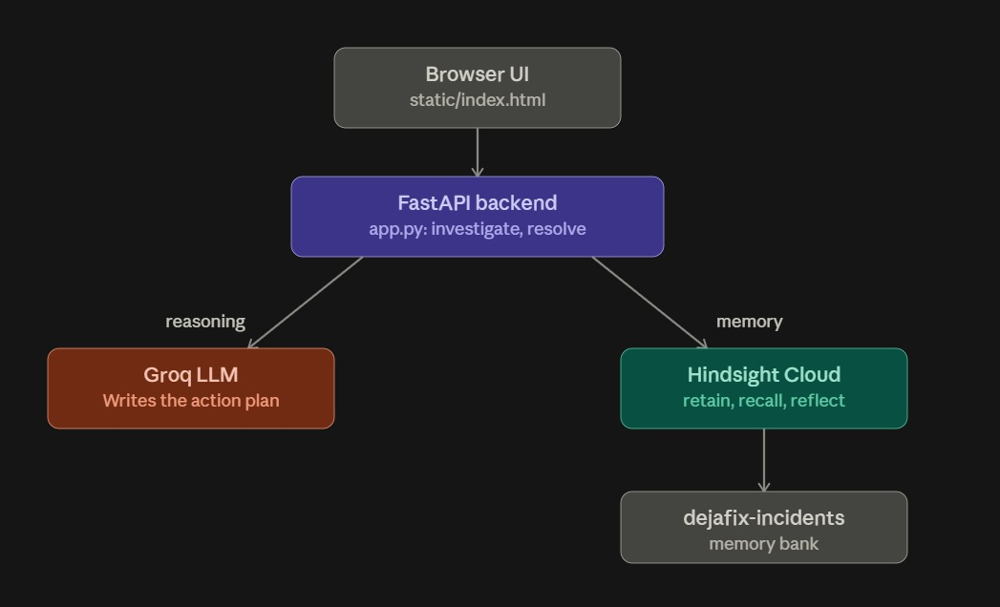
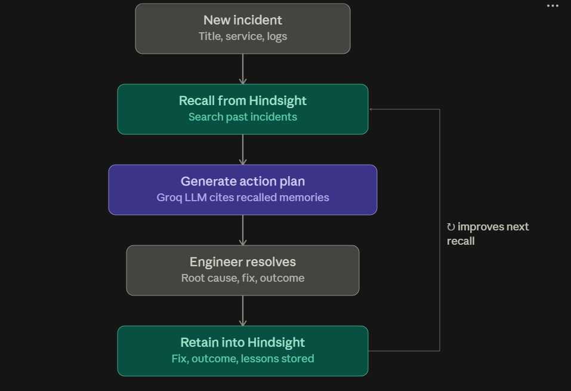
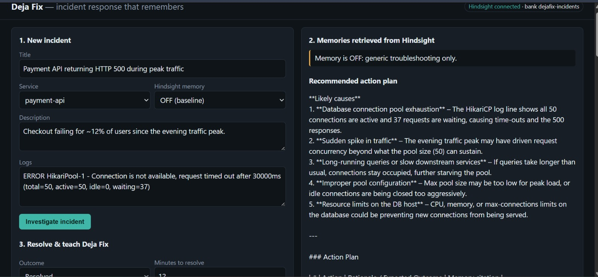
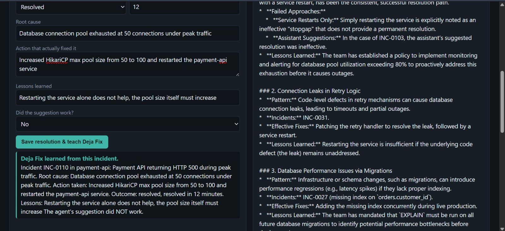
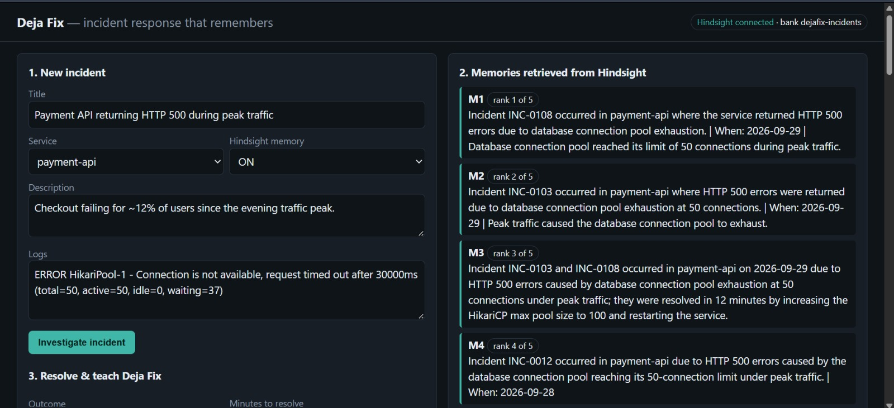
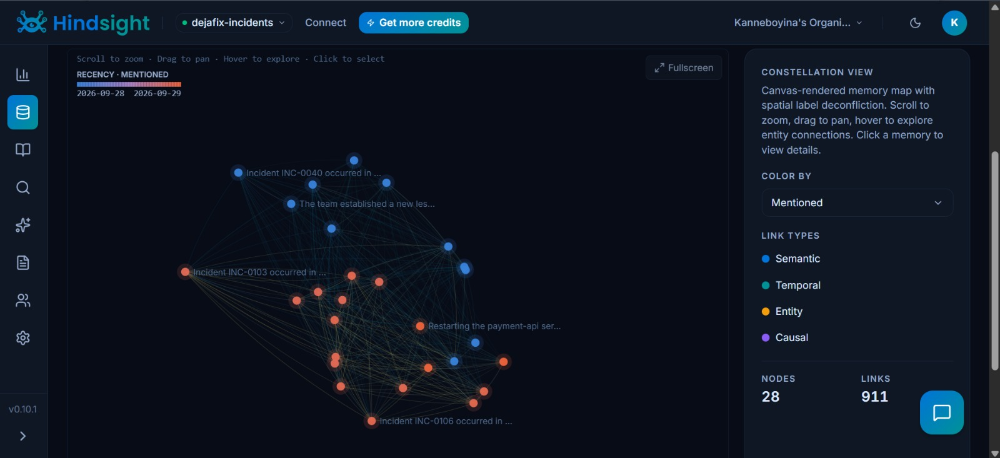
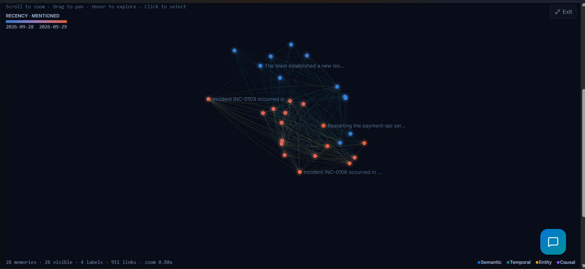
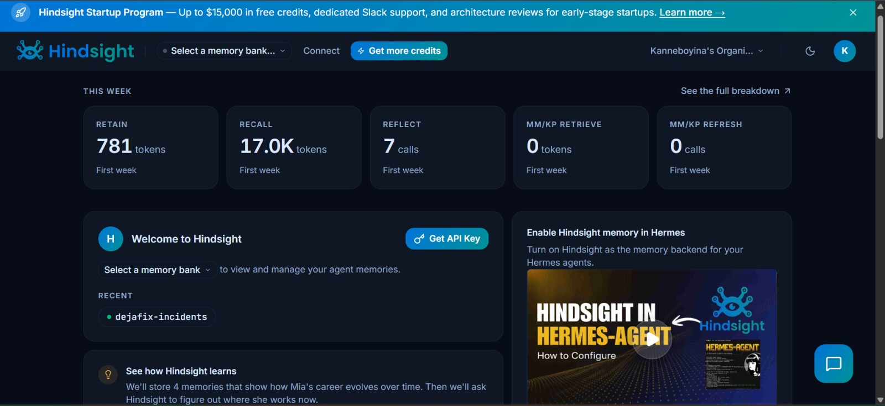

# Deja Fix — incident response that remembers

An on-call agent that recalls past incidents, root causes, and which fixes worked or failed, then learns from each new outcome using [Hindsight](https://hindsight.vectorize.io/) memory.

## Architecture

The browser talks to a FastAPI backend, which splits into two calls: Groq for LLM reasoning, and Hindsight Cloud for memory (retain, recall, reflect) against a dedicated `dejafix-incidents` bank.



## How Hindsight memory is used

- **retain**: on resolution, the incident, root cause, fix, outcome, time and lessons are stored (`POST /api/resolve`, `seed.py`).
- **recall**: every new alert is turned into a query and matched against past incidents (`POST /api/investigate`, memory ON vs OFF toggle).
- **reflect**: synthesizes recurring failure patterns across the bank (`GET /api/reflect`).
- Health: `GET /api/health/hindsight`. If Hindsight is down the UI says so; there is no fake local memory.



## Demo: before and after memory

**Memory OFF — generic troubleshooting, no history:**



**Resolving the incident teaches Deja Fix:**



**Memory ON — a similar incident recalls the exact prior fix:**



**Hindsight's own memory graph, built automatically from retained incidents:**





**The Hindsight dashboard for this project's bank:**



## Run

```
python -m venv .venv && source .venv/bin/activate   # Windows: .venv\Scripts\activate
pip install -r requirements.txt
cp .env.example .env   # fill in Hindsight + Groq keys
python seed.py         # optional: load sample past incidents
uvicorn app:app --reload   # open http://localhost:8000
```

## Environment variables

See `.env.example`. You need:

- `HINDSIGHT_BASE_URL` — `https://api.hindsight.vectorize.io`
- `HINDSIGHT_API_KEY` — from the Hindsight Cloud dashboard
- `HINDSIGHT_BANK_ID` — `dejafix-incidents`
- `GROQ_API_KEY` — from console.groq.com
- `LLM_MODEL` / `LLM_FALLBACK_MODEL` — `openai/gpt-oss-120b` / `qwen/qwen3-32b`

## Tech stack

Python, FastAPI, `hindsight-client`, Groq API, `httpx`, `python-dotenv`, single-page HTML/CSS/JS frontend.

## Demo script

1. Memory OFF, investigate "Payment API 500": generic advice.
2. Resolve it (root cause: pool exhaustion, fix: pool 50 to 100) and save.
3. Memory ON, investigate a similar incident: it cites the earlier one and what failed before.
4. Click Reflect for cross-incident patterns.

## Links

- Hindsight GitHub: https://github.com/vectorize-io/hindsight
- Hindsight docs: https://hindsight.vectorize.io/
- Vectorize agent memory: https://vectorize.io/what-is-agent-memory
